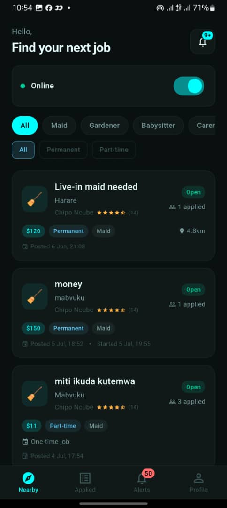
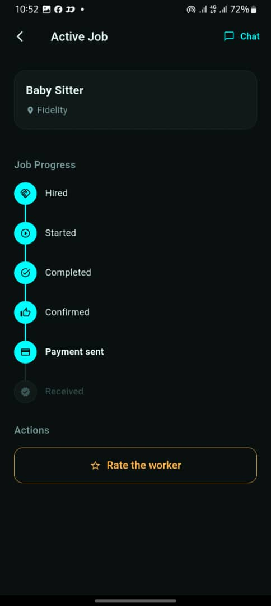
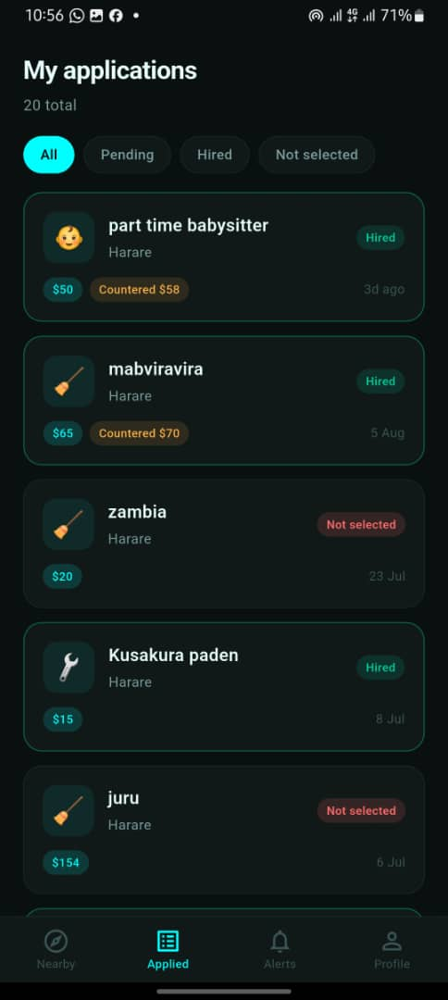
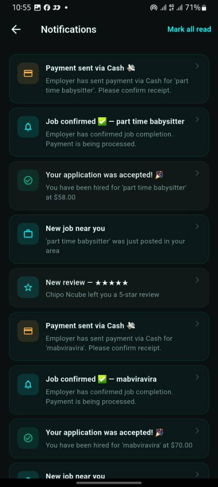
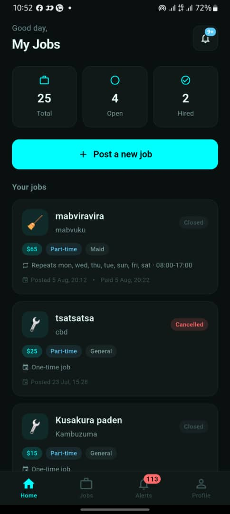
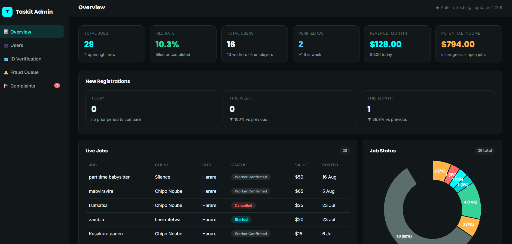

# Taskit API

Backend service for **Taskit**, a domestic services marketplace connecting Zimbabwean households with vetted local workers (cleaners, gardeners, painters, plumbers, childminders and more).

Built and maintained solo, from database schema through to Play Store release.

[](https://www.python.org/)
[](https://fastapi.tiangolo.com/)
[](https://www.postgresql.org/)
[](https://postgis.net/)
[](https://render.com/)

<p align="center">
  
  
  
  
  
  
  
</p>

**Live API:** https://taskit-api-hgou.onrender.com
**API docs:** https://taskit-api-hgou.onrender.com/docs

---

## The problem

Finding reliable domestic help in Zimbabwe runs on word of mouth. Households have no way to verify who they are letting into their home, and skilled workers have no way to build a portable reputation or reach clients beyond their immediate neighbourhood.

Taskit puts both sides on a single platform with identity verification, location-based matching, in-app messaging and a formal complaints process.

---

## What it does

| Capability | Detail |
|---|---|
| **Location-aware matching** | PostGIS geospatial queries rank available workers by real distance from the job, not by suburb name |
| **ID verification** | Workers upload national ID documents for manual review before they can accept jobs |
| **Phone-verified accounts** | OTP sent via SMS, required at signup for both clients and workers |
| **Contact protection** | Phone numbers and exact addresses stay hidden until a worker is formally hired, so the platform cannot be bypassed |
| **Push notifications** | Separate Android channels for job offers, messages and status changes |
| **Complaints and reporting** | Structured dispute flow with admin review, backed by an internal web dashboard |
| **Admin dashboard** | Web interface for ID approvals, complaint triage and platform monitoring |

---

## Architecture

```
┌─────────────────────┐
│  Flutter mobile app │  Riverpod · Dio · GoRouter
└──────────┬──────────┘
           │ HTTPS / JWT
┌──────────▼──────────┐
│    FastAPI backend  │  Render (containerised)
│  ─────────────────  │
│  Auth · Jobs · Chat │
│  Payments · Admin   │
└──┬────────┬─────────┘
   │        │
   │        ├──► Firebase Cloud Messaging  (push)
   │        ├──► Omniflex Zimbabwe         (OTP SMS)
   │        └──► Supabase Storage          (ID documents)
   │
┌──▼──────────────────┐
│ PostgreSQL + PostGIS│  Supabase
└─────────────────────┘
```

### Stack

**Backend** — FastAPI, SQLAlchemy, Alembic, Pydantic, JWT auth
**Database** — PostgreSQL with the PostGIS extension, hosted on Supabase
**Mobile** — Flutter with Riverpod state management, Dio for networking, GoRouter for navigation
**Infrastructure** — Render (API), Supabase (database and object storage), Firebase (push)
**Integrations** — Omniflex Zimbabwe (SMS/OTP), Firebase Cloud Messaging

---

## Engineering notes

A few decisions worth explaining, since they were driven by constraints specific to building for the Zimbabwean market.

### Cloudinary to Supabase Storage

ID verification originally used Cloudinary. Cloudinary is blocked from Zimbabwean networks, so uploads silently failed for the exact users the feature existed to serve. Migrated the whole document pipeline to Supabase Storage, which is reachable locally and already part of the stack.

**Takeaway:** infrastructure choices that are unremarkable elsewhere are not neutral in every market. Test from inside the target network.

### Africa's Talking to Omniflex

OTP delivery through Africa's Talking had inconsistent delivery rates to Zimbabwean numbers. Switched to Omniflex, a local provider, which required reworking the verification flow around a different callback contract and response format.

### Nested SAVEPOINTs around PostGIS writes

Job posting was failing silently in production. The cause was an unprotected PostGIS `UPDATE` inside a larger transaction: when the geospatial write raised, it aborted the enclosing transaction, so the commit became a no-op and the API still returned success.

Fixed by wrapping the geospatial operations in nested `SAVEPOINT`s so a spatial failure rolls back only its own sub-transaction and surfaces a real error instead of a false positive.

```python
# Simplified illustration
async with session.begin():
    job = await create_job(session, payload)
    try:
        async with session.begin_nested():       # SAVEPOINT
            await update_job_location(session, job.id, payload.lat, payload.lng)
    except GeospatialError:
        # Rolls back only the location write; the job row survives,
        # and the caller gets a real error instead of a silent success
        raise HTTPException(422, "Could not resolve job location")
```

**Takeaway:** an operation that returns 200 and writes nothing is worse than one that returns 500. Silent failure cost far more debugging time than a loud one would have.

### Contact detail leakage

An early version of the job listing serialiser returned the full client object, including phone number, to any worker browsing open jobs. Workers could contact clients directly and skip the platform entirely. Fixed with explicit response models per audience rather than serialising ORM objects wholesale.

**Takeaway:** default to allow-lists on API responses. Never let the database schema decide what leaves the server.

---

## Configuration

The backend source is private. Available for review on request during interview processes.

**Stack requirements:** Python 3.11+, PostgreSQL 14+ with the PostGIS extension.

### Environment variables

| Variable | Purpose |
|---|---|
| `DATABASE_URL` | PostgreSQL connection string (PostGIS extension required) |
| `SECRET_KEY` | JWT signing key |
| `SUPABASE_URL` | Supabase project URL |
| `SUPABASE_KEY` | Supabase service key for storage operations |
| `OMNIFLEX_API_KEY` | SMS provider credentials |
| `OMNIFLEX_SENDER_ID` | Registered SMS sender ID |
| `FIREBASE_CREDENTIALS` | Path to the Firebase service account JSON |

---

## API overview

| Group | Endpoints |
|---|---|
| **Auth** | Registration, OTP request and verify, login, token refresh |
| **Users** | Profile management, worker demographics, ID document upload |
| **Jobs** | Create, browse with geospatial ranking, accept, complete, cancel |
| **Chat** | Job-scoped messaging between client and hired worker |
| **Complaints** | Submit, track and resolve disputes |
| **Admin** | ID verification queue, complaint review, platform statistics |

Full schema is available at `/docs` (Swagger) and `/redoc`.

---

## Status

In beta testing ahead of Play Store release. Legal documents (privacy policy, terms of service) are served from the API root.

---

## Author

**Ramson Singano**
MSc Data Science and Informatics, University of Zimbabwe
[LinkedIn](https://www.linkedin.com/in/ramson-singano-8514b0133/) · [GitHub](https://github.com/RamzyX1)
